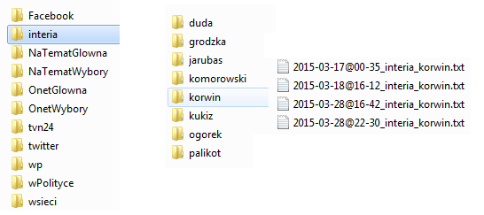

# Przygotowanie danych

Jak pobierałyśmy dane?




Po uporządkowaniu otrzymujemy dwa pliki (struktura podobna jak w danych `auta2012`)

* podsumowanie.txt
* artykuly.txt

### Podsumowanie

```{r, cache=TRUE}
podsumowanie <- read.csv("podsumowanie.txt")
podsumowanie[sample(1:nrow(podsumowanie), 5), ]
```

### Artykuły
Treść artykułu została oczyszczona

* usunięto stopwordsy (podstawowy słownik + własnoręcznie dodane)
* nazwiska i wyrazy "wyborcze" zostały sprowadzone do mianownika

```{r, echo=FALSE, cache=TRUE}
 regexy <- c(
      "(Komorowski(\\p{L})*)|((B|b)ronkobus(\\p{L})*)",
      "Marian(\\p{L})* Kowalsk(\\p{L})*",
      "(Dud(\\p{L})*)|((D|d)udabus(\\p{L})*)",
      "Paliko(\\p{L})*",
      "Jarubas(\\p{L})*",
      "Ogórek(\\p{L})*",
      "Korwin(\\p{L})*",
      "Ann(\\p{L})+ Grodzk(\\p{L})*",
      "Jac(e)*(\\p{L})* Wilk(\\p{L})*",
      "Grzegorz(\\p{L})* Braun(\\p{L})*",
      "Kukiz(\\p{L})*",
      "Tanajn(\\p{L})*",
      "prezydent(\\p{L})*",
      "prezydenck(\\p{L})*",
      "andrzej(\\p{L})*",
      "bronis(\\p{L})*",
      "kaczyński(\\p{L})*",
      "kandyda(\\p{L})*",
      "wybor(\\p{L})*",
      "kampani(\\p{L})*",
      "janusz(\\p{L})*",
      "pols(\\p{L})*",
      "pola(k|c)(\\p{L})*",
      "adam(\\p{L})*",
      "podpis(\\p{L})*"
   )
   
   names(regexy) <- c("komorowski", "kowalski", "duda", "palikot", "jarubas", "ogorek",
                      "korwin", "grodzka", "wilk", "braun", "kukiz", "tanajno", 
                      "prezydent", "prezydenckie", "andrzej", "bronislaw", "kaczynski", "kandydat",
                      "wybory", "kampania", "janusz", "polska", "polacy", "adam",
                      "podpisy")
data.frame(regex=regexy)
```

```{r, cache=TRUE}
artykuly <- read.csv("artykuly.txt")
artykuly[200,]
```

# Wskaźniki
```{r kody, results='hide',echo=FALSE,message=FALSE, cache=TRUE}
all <- c("interia","NaTematGlowna","NaTematWybory","OnetGlowna","OnetWybory","tvn24","wp","wPolityceGlowna","wsieci")

sumaryczna_waga <- function(strona=all){
      require(dplyr)
      dane <- read.csv("podsumowanie.txt")
      
      # wybranie unikatowych artykulow. Czasem zdarza sie ten sam artykul w sekcji newsy i obrazek
      # wowczas wydaje sie uzasadnionym traktowac te rekordy jako rozne. Usuwamy zatem te same artykuly,
      # ktore zostaly wielokrotnie pobrane. Jako wyznacznik identycznosci artykulow traktuje
      # liczbe znakow w nim zawarta.
      dane %>%
            filter(portal%in%strona) %>%
            select(portal,kandydat,dlugosc.art,waga) %>%
            unique -> df
      return( sort(tapply(df$waga,df$kandydat,sum), decreasing = TRUE) )
}
sumaryczna_waga_szczegolowa <- function(strona=all){
      require(dplyr)
      dane <- read.csv("podsumowanie.txt")
      
      # wybranie unikatowych artykulow. Czasem zdarza sie ten sam artykul w sekcji newsy i obrazek
      # wowczas wydaje sie uzasadnionym traktowac te rekordy jako rozne. Usuwamy zatem te same artykuly,
      # ktore zostaly wielokrotnie pobrane. Jako wyznacznik identycznosci artykuolow traktuje
      # liczbe znakow w nim zawarta.
      dane %>%
            filter(portal%in%strona) %>%
            select(portal,kandydat,dlugosc.art,waga) %>%
            unique -> df
      wynik <- sapply(split(df,df$kandydat), function(x) tapply(x$waga,x$portal,sum))
      wynik <- replace(wynik,is.na(wynik),0)  # usuwanie NAs. W tym przypadku oznaczaja one zerowa wage.
      return( wynik[strona,] )
      }
ilosciowo_kandydaci <- function(){
      require(dplyr)
      dane <- read.csv("podsumowanie.txt")
      dane %>%
            select(kandydat) %>%
            table %>%
            sort(decreasing = TRUE)
      }
istnienie_kandydata <- function(osoba,strona,kolor="black",po_czym="waga"){
      require(dplyr)
      dane <- read.csv("podsumowanie.txt")
      dane %>%
            filter(portal%in%strona,kandydat==osoba) %>%
            select(kandydat,portal,data,contains(po_czym)) -> df2
      if( nrow(df2)>0 ){
            as.POSIXct(df2$data) -> df2$data
            
            # dla czytelnosci zamiast ustawiac miesiace w labels podzielimy obszar wykresu na miesiace:
            kwiecien <- as.POSIXct("2015-04-01 01:00:00")
            maj <- as.POSIXct("2015-05-01 01:00:00")
            # pelna os czasu
            date_range <- strptime( range(df2$data), format="%F" )
            hour_axis <- seq( date_range[1], date_range[2], by = "hour" )
            day_axis <- seq( date_range[1], date_range[2], by = "day" )
            
            plot( df2$data,t(df2[po_czym]), xaxt="n", type="p", pch=1, cex=.5, col=kolor,xlab="", ylab=po_czym)
            rect(0,-1,kwiecien,20000,col=rgb(1,0,0,.4),border = NULL)
            rect(kwiecien,-1,maj,20000,col=rgb(0,1,0,.4), border=NULL)
            axis.POSIXct(side=1, at=hour_axis[rep(c(T,F,F,F,F,F),2)],
                         format="%H",las=1, cex.axis=0.75, )  
            axis.POSIXct(side=3, at=day_axis,
                         format="%d",las=1, cex.axis=0.75, "days")  
            mtext(side=1, "hours", line=2.5)
            mtext(side=3, "days", line=2.5)
      }else{
            cat("brak informacji o kandydacie")
      }
}
przeglad_naglowkow <- function(strona=all){
      require(dplyr)
      dane <- read.csv("podsumowanie.txt")
      dane %>%
            filter(portal%in%strona) %>%
            select(portal,kandydat,czy.w.tytule) %>%
            as.data.frame  %>% 
            split(.$kandydat) %>%
            sapply(function(ramka_z_danej_strony)
                  table(ramka_z_danej_strony$portal[ramka_z_danej_strony$czy.w.tytule])
                  ) -> df
      return( df[strona,] )
}
ile_artykulow <- function( osoba, strona=all, kolor="brown", ylim=c(0,100) ){
      require(dplyr)
      require(stringi)
      dane <- read.csv("podsumowanie.txt")
      
      #wybierzemy unikalne artykuly (kluczem unikalnosci bedzie liczba znakow w artykule: dlugosc.art.)
      df <- dane %>% 
                  filter(portal%in%strona, kandydat==osoba) %>%
                  select(portal,kandydat,data,dlugosc.art) %>%
                  unique
      df$day <- as.Date(df$data)
      # UWAGA! nie ma wszystkich dat: jesli danego dnia byla sesja w ktorej nie znaleziono
      # artykulu, powinnismy miec 0 artykulow, jesli nie bylo sesji danego dnia mamy NA.
      # Pobieranie przebiegalo w trzech roznych trybach, na dwoch roznych systemach operacyjnych.
      win1 <- c("NaTematGlowna","OnetGlowna","wPolityceGlowna")
      lin <- c("wp","interia","wsieci","tvn24")
      # dlatego nalezy rozroznic wprowadzone przez uzytkownika strony.
      
      ########### FUNKCJE POMOCNICZE ###########
      dni_sesji_trybu <- function(tryb){
            dane %>%
                  filter(portal%in%tryb) %>%
                  select(data) %>%
                  t  %>% 
                  as.Date  %>% 
                  unique
      }
      agregacja_dniami <- function(tryb){
            df %>%
                  filter(portal%in%strona[strona%in%tryb]) %>%
                  group_by( czas = day ) %>%
                  summarise( liczba_artykulow = length(data) )
            # jest length(data) ale może byc (length( dowolna_kolumna )).
            # chodzi o liczbe rekordow w danym przedziale czasu.
      }
      uzupelnij_zerami <- function(tryb){
            df_trybu <- data.frame(czas2=dni_sesji_trybu(tryb))
            agregacja_dniami(tryb) %>% right_join(df_trybu, by=c("czas" = "czas2")) -> newdf
            newdf[is.na(newdf)] <- 0
            return( arrange(newdf,czas) )
      }
      #########################################

      if( any(strona%in%win1) ){
            a <- uzupelnij_zerami(win1)
            if( any(strona%in%lin) ){
                  b <- uzupelnij_zerami(lin)
                  # poniewaz podany parametr strona zawiera portale z dwoch roznych trybow,
                  # nalezy zsumowac liczbe artykulow zagregowana w dwoch roznych trybach.
                  # zrobimy to na "zjoinowanej" po czasie tabeli.
                  # zalozenie: sesje windowsa zawieraja sesje linuksa. i to jest prawda poki co.
                  c <- full_join(a,b, by="czas") %>% transmute(czas,liczba_artykulow=liczba_artykulow.x+liczba_artykulow.y)
                  d <- as.data.frame(c)
            } else {
                  d <- as.data.frame(a)
            }
      }else{
            d <- as.data.frame(uzupelnij_zerami(lin))
      }       

      # pelna os czasu
      date_range <- range(as.Date(dane$data))
      day_axis <- seq( date_range[1], date_range[2], by = "day" )
      # hour_axis <- seq( date_range[1], date_range[2], by = "hour" )

      # plotowanie
      # dla czytelnosci zamiast ustawiac miesiace w labels podzielimy obszar wykresu na miesiace:
      kwiecien <- as.Date("2015-04-01")
      maj <- as.Date("2015-05-01")
      plot(liczba_artykulow ~ czas, d,
           type="l", lwd=3, col=kolor, xaxt="n", ylim=ylim, xlab="dzien miesiaca"
           , main=if(all(strona==all)) "all" else strona
           )
      rect(0,-1,kwiecien,200,col=rgb(1,0,0,.1),border = NULL)
      rect(kwiecien,-1,maj,200,col=rgb(0,1,0,.1), border=NULL)
      axis.Date(1, at = day_axis[day_axis%in%d$czas], las=2, format="%d", cex.axis=.8)    
      axis.Date(1, at = day_axis[!(day_axis%in%d$czas)], las=2, format="%d", col.axis="red", cex.axis=.8)  # na czerwono braki danych

}
```

## [Sumaryczne wagi artykulow](#sumowaniewag){#tam}

> IDEA: Funkcja zwraca tabelkę wszystkich kandydatów z sumarycznymi wagami unikatowych artykulów. Jedna z funkcji zrobi to bez rozrozniania portali, druga z rozroznieniem portali

```{r set-options, dependson='kody', message=FALSE, echo=-1, cache=TRUE}
options(width = 100)
sumaryczna_waga()
sumaryczna_waga("wp")

sumaryczna_waga_szczegolowa()
sumaryczna_waga_szczegolowa(strona=c("wp","interia"))
````

## [Ile razy można było przeczytać o danym kandydacie](#ilosciowokandydaci){#tam2}
Zliczane sa tu wszystkie - jak leci - nazwiska.
Co jesli artykul sie powtarzal?
Nie szkodzi. Tu interesuje nas czy gdy sie weszlo o danej godzinie do internetu, 
to czy mozna bylo o kandydacie poczytać. 
```{r, dependson='kody', message=FALSE}
ilosciowo_kandydaci()
````

## [Przegląd nagłówków](#przegladnaglowkow){#tam3}
Funkcja zlicza ile razy w naglowku wystapilo nazwisko danego kandydata.
Nie uwgledniamy unikatowych artykulow ale to, czy gdy sie weszlo o dowolnej porze do internetu 
nazwisko kandydata uderzalo nas po oczach ze wszystkich wokolo naglowkow.
```{r, dependson='kody', message=FALSE}
# ze wszystkich portali:
przeglad_naglowkow()
# z wybranych portali:
przeglad_naglowkow(strona=c("tvn24","wsieci"))
````


## [Istnienie kandydata w sieci](#istnieniewsieci){#tam4}
Funkcja ma pokazywac istnienie kandydata w czasie i na portalu, tzn. w jakim czasie można było o kandydacie najwięcej poczytać. O którym kandydacie najwięcej. Jak zmieniała się tendencja.
Dlatego nie jest ważne, że te same artykuły moga się powielać: istotą jest, czy w ogóle kandydat istniał.

Problemem tutaj (i wszędzie tak naprawdę) jest to, ze brak punktu nie oznacza, że o kandydacie nie pisano. Wszak moze byc, ze nie bylo pobierania o danej porze.

```{r, dependson='kody', message=FALSE, fig.align='center', fig.width=8,cache=TRUE}
# proste dzialanie
istnienie_kandydata(osoba="komorowski", strona="tvn24", po_czym = "waga")
#

istnienie_kandydata(osoba="korwin", strona="wp")
# dwa portale
istnienie_kandydata(osoba="komorowski", strona=c("wp","interia"), kolor="red")
# TRZY portale :D
istnienie_kandydata(osoba="komorowski", strona=c("wp","interia","tvn24"))
# inny wskaźnik
istnienie_kandydata(osoba="komorowski", strona="tvn24", kolor="red", po_czym = "dlugosc.art")

````

## [Liczba artykułów](#liczbaart){#tam5}
Funkcja rysuje wykres ilosci artykulow o danym kandydacie kazdego dnia.
Opcjonalne jest ustawienie portali, ktorych dane nas interesują.
Zliczane są artykuly UNIKATOWE, różne teksty o kandydacie: nie interesuje nas tutaj jak dlugo dany artykul wisiał na stronie.
Jako różne traktujemy dwa artykuly o tej samej treści, jednak pochodzących z różnych miejsc na stronie.
```{r, dependson='kody', message=FALSE, cache=TRUE, warning=FALSE, fig.width=8, fig.align='center'}
# przyklad bez NAs
ile_artykulow(osoba="duda",strona="wPolityceGlowna")
ile_artykulow(osoba="duda",strona="wp", ylim=c(0,5))

# obsluga NAs
ile_artykulow(osoba="duda",strona=c("wPolityceGlowna","wp"))

# Łączenie wykresów.
ile_artykulow(osoba="komorowski","wsieci", ylim=c(0,20))
par(new=TRUE)
ile_artykulow(osoba="duda", "wsieci", kolor="green", ylim=c(0,20))

```


# Cloudy

Dla scalonych artykułów (wszystkich lub filtorwanych względem portalu/kandydata) dla określonej liczby najczęstszych słów.

```{r, echo=FALSE, warning=FALSE, message=FALSE}
library(stringi)
library(wordcloud)
library(dplyr)

artykuly <- read.csv("artykuly.txt")

#na razie rozwazam tylko filtrowanie po portalu i kandydacie
#w kolejnej fazie weźmiemy również pod uwagę jak to się zmienia czasowo
#domyślnie do chmury bierzemy 150 njczęstszych słów
#i - kolumna w której znajduje się treść (funkcja aplikuje sie również do twittow czy facebooka)
zrobChmure <- function(art, port="", kand="", czas=c(), 
                       ile.slow=150, i=5){
   if(port != "") art <- art %>% filter(portal == port)
   if(kand != "") art <- art %>% filter(kandydat == kand)
   
   tresc <- art[, i]
   words <- unlist(stri_extract_all_words(tresc))
   tab <- table(words)
   tab.sort <- sort(tab, dec=TRUE)
   do.chmury <- tab.sort[1:ile.slow]

   pal2 <- brewer.pal(8,"Set2")
   wordcloud(names(do.chmury), do.chmury, scale=c(4, 0.4), max.words=Inf, 
             random.order=F, rot.per=.3, colors=pal2)
   tab.podst <- tab.sort[1:10]
   return(tab.podst)
}

```

####Dla wszystkich danych
```{r, warning=FALSE, message=FALSE}
zrobChmure(artykuly, ile.slow=100)
```

####Dla kandydatów w tym samym portalu
```{r, warning=FALSE, message=FALSE}
zrobChmure(artykuly, port="wsieci", kand="duda", ile.slow=100)
zrobChmure(artykuly, port="wsieci", kand="komorowski", ile.slow=100)
```

####Ile kandydata w artykule o nim?
```{r, warning=FALSE, message=FALSE}
zrobChmure(artykuly, kand="korwin")
zrobChmure(artykuly, kand="braun")
```

# Portale spolecznosciowe
## Twitter

```{r, echo=FALSE}
ile_tweetow <- function(){
   gl <- "D:/GoogleDrive/Studia/SemestrVIII/R-i-Big-Data/Wybory"
      nazwy <- c("komorowski","duda","kukiz","ogorek","palikot","wilk","korwin","braun","kowalski","jarubas")
      liczba_tweetow <- numeric(length(nazwy))
      
      for(i in seq_along(nazwy)){
            kandydat <- read.csv(paste0(gl, "/dane/twitter_rozdzielone/",nazwy[i]))
            #kandydat <- read.csv(paste0("~/Wybory/dane/twitter_rozdzielone/",nazwy[i]))
            liczba_tweetow[i] <- nrow(unique(kandydat["text"]))
      }
      
      barplot(liczba_tweetow,names.arg=nazwy,las=2)
}
ile_tweetow()
```


# Kody
Tworzenie tabel podsumowanie.txt
```{r}
# pobierzDane <- function(portal, x){
#    kod1 <- c("NaTematGlowna", "NaTematWybory", "OnetGlowna", "OnetWybory", "wPolityceGlowna")
#    kod2 <- c("interia", "tvn24", "wp", "wsieci")
#    if(portal %in% kod1) dane <- read.csv(x)
#    if(portal %in% kod2) dane <- read.csv(x, encoding = "UTF-8")
#    return(dane)
# }
# 
# znajdzKolumny <- function(portal, dane){
#    if(portal %in% c("NaTematGlowna", "NaTematWybory", "OnetWybory")){
#       tytul <- dane[, 1]
#       artykul <- dane[, 3]
#       typ <- rep("brak", nrow(dane))
#    }
#    if(portal %in% c("OnetGlowna")){
#       tytul <- dane[, 1]
#       artykul <- dane[, 2]
#       typ <- dane[, 4]
#    }
#    if(portal %in% c("interia", "wp", "wsieci")){
#       tytul <- dane[, 2]
#       artykul <- dane[, 3]
#       typ <- dane[, 1]
#    }
#    if(portal == "tvn24"){
#       tytul <- dane[, 3]
#       artykul <- dane[, 4]
#       typ <- dane[, 1]
#    }
#    if(portal == "wPolityceGlowna"){
#       tytul <- dane[, 1]
#       artykul <- dane[, 5]
#       typ <- dane[, 4]
#    }
#    return(list(tytul, artykul, typ))
# }
# 
# nadajDate <- function(nazwa){
#    czy.z.godzina <- stri_detect_fixed(nazwa, "@")
#    if(czy.z.godzina == TRUE){
#       data <-  as.character(strptime(nazwa, "%F@%H-%M"))
#    } else {
#       data <- as.character(strptime(nazwa, "%F"))
#       data <- paste(data, "00:00:00")
#    }
#    return(data)
# }
# 
# nadajWage <- function(portal, typ){
#    n <- length(typ)
#    waga <- numeric(n)
#    if(typ[1]=="brak"){ #OnetWybory, #NaTematGlowna, #NaTematWybory
#       waga <- rep(2, n) #taka sama wszedzie 
#    }
#    if(portal=="interia"){
#       waga[typ=="duży news"] = 4
#       waga[typ=="obrazki duze"] = 3
#       waga[typ=="newsy"] = 2
#    }
#    if(portal=="OnetGlowna"){
#       waga[typ=="duze"] = 4
#       waga[typ=="srednie"] = 3
#       waga[typ=="male"] = 2
#    }
#    if(portal=="tvn24"){
#       waga[typ=="newsy"] = 2
#       waga[typ=="obrazki"] = 3
#       waga[typ=="maintopic"] = 4
#    }
#    if(portal=="wp"){
#       waga[typ=="main topic"] = 4
#       waga[typ=="news"] = 2
#       waga[typ=="obrazki"] = 3
#       waga[typ=="male obrazki"] = 1
#    }
#    if(portal=="wPolityceGlowna"){
#       waga[typ=="top"] = 4
#       waga[typ=="top2"] = 4
#       waga[typ=="duze"] = 3
#       waga[typ=="srednie"] = 2
#       waga[typ=="male"] = 2
#       waga[typ=="mini"] = 1
#    }
#    if(portal=="wsieci"){
#       waga[typ=="glowna"] = 4
#       waga[typ=="obrazki"] = 3
#    }
#    return(waga)
# }
# 
# 
# ############################################################################ 
# # dla danego folderu typu np. interia/komorowski robimy ramke danych
# # z plików, które nie były jeszcze dołączone
# ############################################################################ 
# 
# zrobListeRamekPortalKandydat <- function(pliki){
#    regexy <- c(
#       "(Komorowski(\\p{L})*)|((B|b)ronkobus(\\p{L})*)",
#       "Marian(\\p{L})* Kowalsk(\\p{L})*",
#       "(Dud(\\p{L})*)|((D|d)udabus(\\p{L})*)",
#       "Paliko(\\p{L})*",
#       "Jarubas(\\p{L})*",
#       "Ogórek",
#       "Korwin(\\p{L})*",
#       "Ann(\\p{L})+ Grodzk(\\p{L})*",
#       "Jac(e)*(\\p{L})* Wilk(\\p{L})*",
#       "Grzegorz(\\p{L})* Braun(\\p{L})*",
#       "Kukiz(\\p{L})*",
#       "Tanajn(\\p{L})*"
#    )
#    
#    names(regexy) <- c("komorowski", "kowalski", "duda", "palikot", "jarubas", "ogorek",
#                       "korwin", "grodzka", "wilk", "braun", "kukiz", "tanajno")
#    
#    lista.ramek.portal.kandydat <- lapply(pliki, function(x){
#       
#       portal <- stri_extract_first_regex(x, "(?<=_)[^_]+")
#       kandydat <- stri_extract_last_regex(x, "(?<=_)[^(\\.|_)]+")
#       
#       dane <- pobierzDane(portal, x)
#       n <- nrow(dane)
#       kolumny <- znajdzKolumny(portal, dane)
#       
#       #data artykułu (przyjmujemy dla ujednolicenia, że data artykułu to data jego pobrania)
#       kiedy <- nadajDate(x)
#       data <- rep(kiedy, n)
#       #nr artykułu (w danym pliku, czyli w danym dniu i ewentualnie o danej godzinie)
#       nr <- c(1:n)
#       #czy nazwisko kandydata pojawia sie w tytule artykulu
#       regex <- paste("(?i)", regexy[kandydat], sep="")
#       czy.w.tytule <- stri_detect_regex(kolumny[[1]], regex)
#       #długość artykułu
#       tresc <- as.character(kolumny[[2]])
#       dlugosc.art <- nchar(tresc)
#       #ile razy w artykule pojawia się regex kandydata
#       ile.razy <- stri_count_regex(tresc, regex)
#       #częstość występowania regexa w artykule
#       ile.razy.wzg <- ile.razy/dlugosc.art
#       #waga artykulu
#       typ <- kolumny[[3]]
#       waga <- nadajWage(portal, typ)
#       
#       #ramka danych dla pojedynczego pliku
#       ramka.plik <- data.frame(portal, kandydat, data, nr, czy.w.tytule, dlugosc.art, ile.razy, 
#                                ile.razy.wzg, waga, stringsAsFactors=FALSE)
#       return(ramka.plik)
#    })
#    return(lista.ramek.portal.kandydat)
# }
# 
# 
# zrobJednaRamkePortalKandydat <- function(dataFrameList){
#    n <- length(dataFrameList)
#    if (n==1){
#       return(dataFrameList[[1]])
#    } else {
#       tmpDataFrame <- dataFrameList[[1]]
#       for (i in 2:n){
#          bindDataFrames <- rbind(tmpDataFrame, dataFrameList[[i]])
#          tmpDataFrame <- bindDataFrames
#       }
#       return(tmpDataFrame)
#    }
# }
# 
# 
# ############################################################################ 
# # odpalanie funkcji powyżej 
# ############################################################################ 
# 
# #ustawianie ścieżki do folderu z danymi
# setwd("D:/GoogleDrive/Studia/SemestrVIII/R-i-Big-Data/Wybory/dane")
# glowna <- getwd()
# 
# #szukamy scieżek do folderów portal/kandydat
# foldery.all <- list.dirs(full.names = FALSE)
# ktore.nietwitter <- !stri_detect_regex(foldery.all, "twitter")
# ktore.niefacebook <- !stri_detect_regex(foldery.all, "(?i)facebook")
# ktore.nieglowne <- stri_detect_regex(foldery.all, "/")
# #lista folderów dla poszczególnych kandydatów z danych portali 
# #(z wyłączeniem twittera i facebooka)
# foldery <- foldery.all[ktore.nietwitter & ktore.niefacebook & ktore.nieglowne]
# 
# a <- list()
# if(!file.exists("podsumowanie.txt")){
#    
#    for (i in seq_along(foldery)){
#       sciezka <- foldery[i]
#       setwd(file.path(glowna, sciezka))
#       pliki.all <- list.files()
#       if(length(pliki.all) > 0) {
#          a[[i]] <- zrobJednaRamkePortalKandydat(zrobListeRamekPortalKandydat(pliki.all))
#       }
#       setwd(glowna)
#    }
#    b <- zrobJednaRamkePortalKandydat(a)
#    write.table(b, "podsumowanie.txt", row.names=FALSE, sep=",")
#    
# } else {
#    
#    #wczytujemy plik podsumowanie, do którego będziemy dołączać kolejne wiersze
#    podsumowanie <- read.csv("podsumowanie.txt")
#    for (i in seq_along(foldery)){
#       sciezka <- foldery[i]
#       print(sciezka)
#       setwd(file.path(glowna, sciezka))
#       
#       portal.tmp <- stri_extract_first_regex(sciezka, "[^/]+")
#       kandydat.tmp <- stri_extract_last_regex(sciezka, "[^/]+")
#       
#       #niestety dla jednego portalu mamy małą rozbieżność nazw
#       if(portal.tmp == "wPolityce") portal.tmp <- "wPolityceGlowna"
#       
#       #maksymalna data dla portalu i kandydata w pliku podsumowanie.txt
#       portalKandydat <- podsumowanie %>%
#          filter(portal == portal.tmp, kandydat == kandydat.tmp) 
#       if(nrow(portalKandydat) == 0) next
#       
#       max.data <- portalKandydat %>%
#          summarise(max.data = max(strftime(data, "%F %T")))
#       max.data <- as.character(max.data)
#       max.data <- strptime(max.data, "%F %T")
#       
#       #szukamy plików z datą młodszą niż znaleziona w pliku
#       #i tylko dane z tych plików dołączamy do obecnych danych
#       pliki.all <- list.files()
#       n <- length(pliki.all)
#       if(n == 0) next
#       
#       #sprawdzamy czy pliki są z godziną czy bez (sama data)
#       ost <- pliki.all[n]
#       czy.godzina <- stri_detect_regex(ost, "@")
#       if(czy.godzina == TRUE){
#          data.pliku <- strptime(ost, "%F@%H-%M")
#          indeksy.nowe <- logical(n)
#          while(data.pliku - max.data > 0){
#             indeksy.nowe[n] <- TRUE
#             n <- n - 1
#             if (n == 0) next
#             plik.tmp <- pliki.all[n]
#             data.pliku <- strptime(plik.tmp, "%F@%H-%M")
#          }
#       } else {
#          data.pliku <- strptime(ost, "%F")
#          indeksy.nowe <- logical(n)
#          while(data.pliku - max.data > 0){
#             indeksy.nowe[n] <- TRUE
#             n <- n - 1
#             if (n == 0) next
#             plik.tmp <- pliki.all[n]
#             data.pliku <- strptime(plik.tmp, "%F")
#          }
#       }
#       
#       #nazwy nowych plikow 
#       pliki <- pliki.all[indeksy.nowe]
# 
#       if(length(pliki) > 0) {
#          a[[i]] <- zrobJednaRamkePortalKandydat(zrobListeRamekPortalKandydat(pliki))
#       }
#       setwd(glowna)
#    }
#    if(length(a) > 0){
#       b <- zrobJednaRamkePortalKandydat(a)
#       write.table(b, "podsumowanie.txt", row.names=FALSE, col.names = FALSE, 
#                   append=TRUE, sep=",") 
#    }   
# }
```

##[Sumowanie wag](#tam){#sumowaniewag}
```{r, results='hide',echo=TRUE,message=FALSE, cache=TRUE}
sumaryczna_waga <- function(strona=all){
      require(dplyr)
      dane <- read.csv("prezentacja2/podsumowanie.txt")
      
      # wybranie unikatowych artykulow. Czasem zdarza sie ten sam artykul w sekcji newsy i obrazek
      # wowczas wydaje sie uzasadnionym traktowac te rekordy jako rozne. Usuwamy zatem te same artykuly,
      # ktore zostaly wielokrotnie pobrane. Jako wyznacznik identycznosci artykulow traktuje
      # liczbe znakow w nim zawarta.
      dane %>%
            filter(portal%in%strona) %>%
            select(portal,kandydat,dlugosc.art,waga) %>%
            unique -> df
      return( sort(tapply(df$waga,df$kandydat,sum), decreasing = TRUE) )
}

sumaryczna_waga_szczegolowa <- function(strona=all){
      require(dplyr)
      dane <- read.csv("prezentacja2/podsumowanie.txt")
      
      # wybranie unikatowych artykulow. Czasem zdarza sie ten sam artykul w sekcji newsy i obrazek
      # wowczas wydaje sie uzasadnionym traktowac te rekordy jako rozne. Usuwamy zatem te same artykuly,
      # ktore zostaly wielokrotnie pobrane. Jako wyznacznik identycznosci artykuolow traktuje
      # liczbe znakow w nim zawarta.
      dane %>%
            filter(portal%in%strona) %>%
            select(portal,kandydat,dlugosc.art,waga) %>%
            unique -> df
      wynik <- sapply(split(df,df$kandydat), function(x) tapply(x$waga,x$portal,sum))
      wynik <- replace(wynik,is.na(wynik),0)  # usuwanie NAs. W tym przypadku oznaczaja one zerowa wage.
      return( wynik[strona,] )
      }
```

##[Ilościowo kandydaci](#tam2){#ilosciowokandydaci}
```{r}
ilosciowo_kandydaci <- function(){
      require(dplyr)
      dane <- read.csv("prezentacja2/podsumowanie.txt")
      dane %>%
            select(kandydat) %>%
            table %>%
            sort(decreasing = TRUE)
      }
```

##[Istnienie kandydata](#tam4){#przegladnaglowkow}
```{r}
istnienie_kandydata <- function(osoba,strona,kolor="black",po_czym="waga"){
      require(dplyr)
      dane <- read.csv("prezentacja2/podsumowanie.txt")
      dane %>%
            filter(portal%in%strona,kandydat==osoba) %>%
            select(kandydat,portal,data,contains(po_czym)) -> df2
      if( nrow(df2)>0 ){
            as.POSIXct(df2$data) -> df2$data
            
            # dla czytelnosci zamiast ustawiac miesiace w labels podzielimy obszar wykresu na miesiace:
            kwiecien <- as.POSIXct("2015-04-01 01:00:00")
            maj <- as.POSIXct("2015-05-01 01:00:00")
            # pelna os czasu
            date_range <- strptime( range(df2$data), format="%F" )
            hour_axis <- seq( date_range[1], date_range[2], by = "hour" )
            day_axis <- seq( date_range[1], date_range[2], by = "day" )
            
            plot( df2$data,t(df2[po_czym]), xaxt="n", type="p", pch=1, cex=.5, col=kolor,xlab="", ylab=po_czym)
            rect(0,-1,kwiecien,1000000,col=rgb(1,0,0,0.4),border = NULL)
            rect(kwiecien,-1,maj,1000000,col=rgb(0,1,0,.4), border=NULL)
            axis.POSIXct(side=1, at=hour_axis[rep(c(T,F,F,F,F,F),2)],
                         format="%H",las=1, cex.axis=0.75, )  
            axis.POSIXct(side=3, at=day_axis,
                         format="%d",las=1, cex.axis=0.75, "days")  
            mtext(side=1, "hours", line=2.5)
            mtext(side=3, "days", line=2.5)
      }else{
            cat("brak informacji o kandydacie")
      }
}
```

##[Przegląd nagłówków](#tam3){#przegladnaglowkow}
```{r}
przeglad_naglowkow <- function(strona=all){
      require(dplyr)
      dane <- read.csv("prezentacja2/podsumowanie.txt")
      dane %>%
            filter(portal%in%strona) %>%
            select(portal,kandydat,czy.w.tytule) %>%
            as.data.frame  %>% 
            split(.$kandydat) %>%
            sapply(function(ramka_z_danej_strony)
                  table(ramka_z_danej_strony$portal[ramka_z_danej_strony$czy.w.tytule])
                  ) -> df
      return( df[strona,] )
}
````

##[Ile artykułów](#tam5){#liczbaart}
```{r}
ile_artykulow <- function( osoba, strona=all, kolor="brown", ylim=c(0,100) ){
      require(dplyr)
      require(stringi)
      dane <- read.csv("prezentacja2/podsumowanie.txt")
      
      #wybierzemy unikalne artykuly (kluczem unikalnosci bedzie liczba znakow w artykule: dlugosc.art.)
      df <- dane %>% 
                  filter(portal%in%strona, kandydat==osoba) %>%
                  select(portal,kandydat,data,dlugosc.art) %>%
                  unique
      df$day <- as.Date(df$data)
      # UWAGA! nie ma wszystkich dat: jesli danego dnia byla sesja w ktorej nie znaleziono
      # artykulu, powinnismy miec 0 artykulow, jesli nie bylo sesji danego dnia mamy NA.
      # Pobieranie przebiegalo w trzech roznych trybach, na dwoch roznych systemach operacyjnych.
      win1 <- c("NaTematGlowna","OnetGlowna","wPolityceGlowna")
      lin <- c("wp","interia","wsieci","tvn24")
      # dlatego nalezy rozroznic wprowadzone przez uzytkownika strony.
      
      ########### FUNKCJE POMOCNICZE ###########
      dni_sesji_trybu <- function(tryb){
            dane %>%
                  filter(portal%in%tryb) %>%
                  select(data) %>%
                  t  %>% 
                  as.Date  %>% 
                  unique
      }
      agregacja_dniami <- function(tryb){
            df %>%
                  filter(portal%in%strona[strona%in%tryb]) %>%
                  group_by( czas = day ) %>%
                  summarise( liczba_artykulow = length(data) )
            # jest length(data) ale może byc (length( dowolna_kolumna )).
            # chodzi o liczbe rekordow w danym przedziale czasu.
      }
      uzupelnij_zerami <- function(tryb){
            df_trybu <- data.frame(czas2=dni_sesji_trybu(tryb))
            agregacja_dniami(tryb) %>% right_join(df_trybu, by=c("czas" = "czas2")) -> newdf
            newdf[is.na(newdf)] <- 0
            return( arrange(newdf,czas) )
      }
      #########################################

      if( any(strona%in%win1) ){
            a <- uzupelnij_zerami(win1)
            if( any(strona%in%lin) ){
                  b <- uzupelnij_zerami(lin)
                  # poniewaz podany parametr strona zawiera portale z dwoch roznych trybow,
                  # nalezy zsumowac liczbe artykulow zagregowana w dwoch roznych trybach.
                  # zrobimy to na "zjoinowanej" po czasie tabeli.
                  # zalozenie: sesje windowsa zawieraja sesje linuksa. i to jest prawda poki co.
                  c <- full_join(a,b, by="czas") %>% transmute(czas,liczba_artykulow=liczba_artykulow.x+liczba_artykulow.y)
                  d <- as.data.frame(c)
            } else {
                  d <- as.data.frame(a)
            }
      }else{
            d <- as.data.frame(uzupelnij_zerami(lin))
      }       

      # pelna os czasu
      date_range <- range(as.Date(dane$data))
      day_axis <- seq( date_range[1], date_range[2], by = "day" )
      # hour_axis <- seq( date_range[1], date_range[2], by = "hour" )

      # plotowanie
      # dla czytelnosci zamiast ustawiac miesiace w labels podzielimy obszar wykresu na miesiace:
      kwiecien <- as.Date("2015-04-01")
      maj <- as.Date("2015-05-01")
      plot(liczba_artykulow ~ czas, d,
           type="l", lwd=3, col=kolor, xaxt="n", ylim=ylim, xlab="dzien miesiaca"
           , main=if(all(strona==all)) "all" else strona
           )
      rect(0,-1,kwiecien,200,col=rgb(1,0,0,.1),border = NULL)
      rect(kwiecien,-1,maj,200,col=rgb(0,1,0,.1), border=NULL)
      axis.Date(1, at = day_axis[day_axis%in%d$czas], las=2, format="%d", cex.axis=.8)    
      axis.Date(1, at = day_axis[!(day_axis%in%d$czas)], las=2, format="%d", col.axis="red", cex.axis=.8)  # na czerwono braki danych

}
```

Funkcja do tworzenia chmury słów i tabelki z najczęstszymi wyrazami
```{r}

#na razie rozwazam tylko filtrowanie po portalu i kandydacie
#w kolejnej fazie weźmiemy również pod uwagę jak to się zmienia czasowo
#domyślnie do chmury bierzemy 150 njczęstszych słów
#i - kolumna w której znajduje się treść (funkcja aplikuje sie również do twittow czy facebooka)
zrobChmure <- function(art, port="", kand="", czas=c(), 
                       ile.slow=150, i=5){
   if(port != "") art <- art %>% filter(portal == port)
   if(kand != "") art <- art %>% filter(kandydat == kand)
   
   tresc <- art[, i]
   words <- unlist(stri_extract_all_words(tresc))
   tab <- table(words)
   tab.sort <- sort(tab, dec=TRUE)
   do.chmury <- tab.sort[1:ile.slow]

   pal2 <- brewer.pal(8,"Set2")
   wordcloud(names(do.chmury), do.chmury, scale=c(5.5, 0.4), max.words=Inf, 
             random.order=F, rot.per=.3, colors=pal2)
   tab.podst <- tab.sort[1:10]
   return(tab.podst)
}
```
